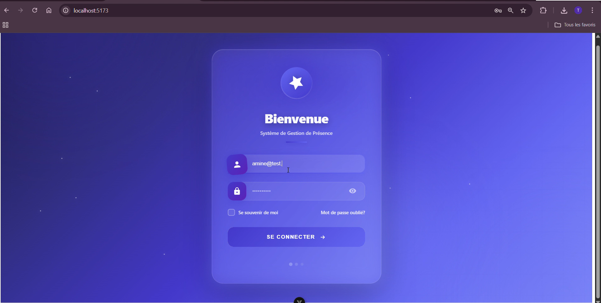
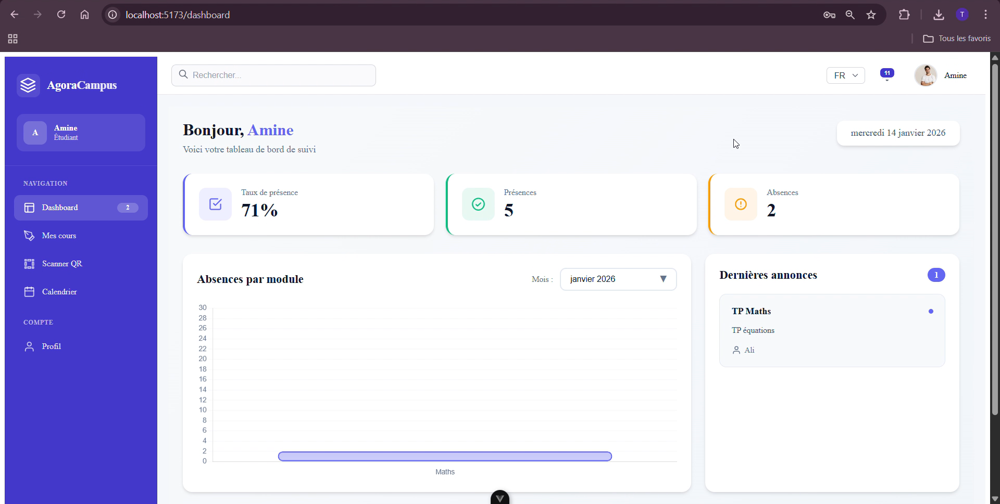
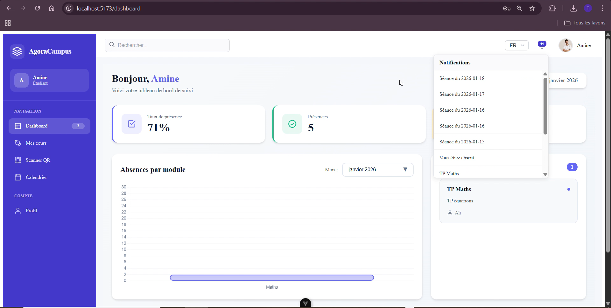
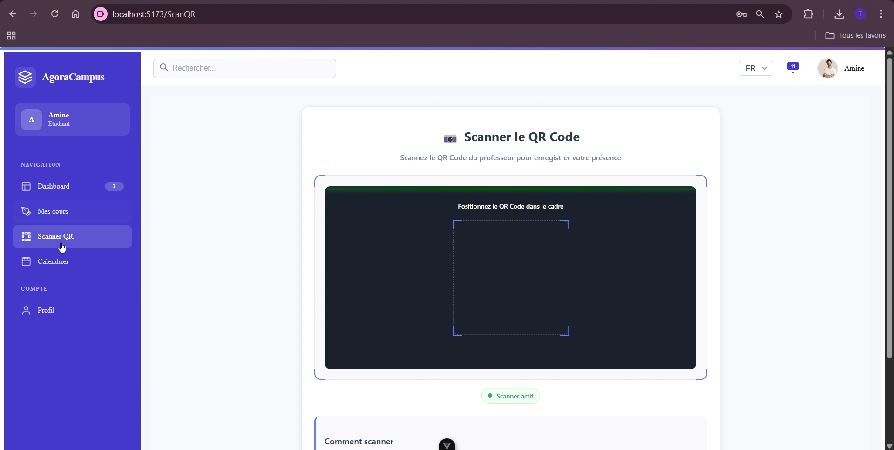
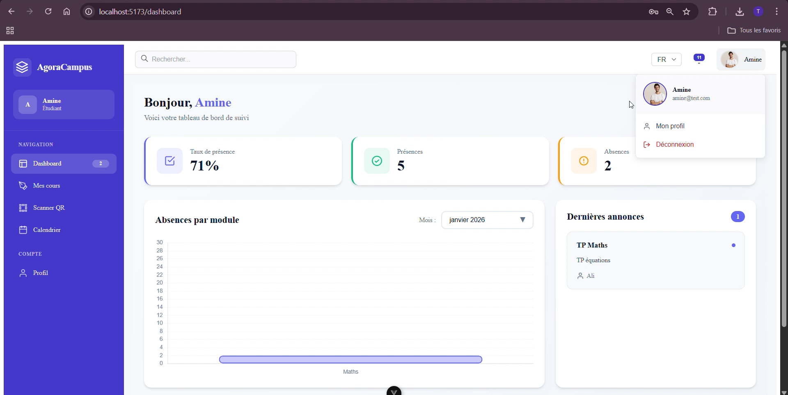
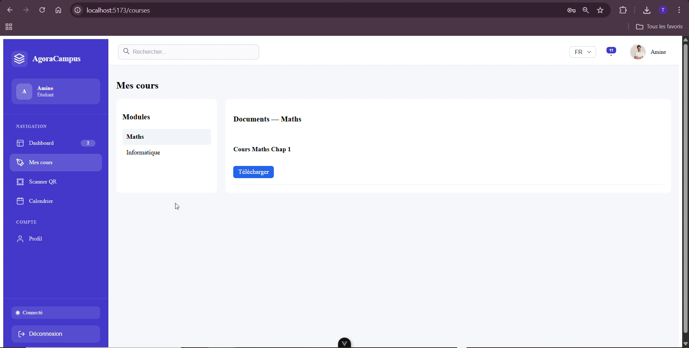
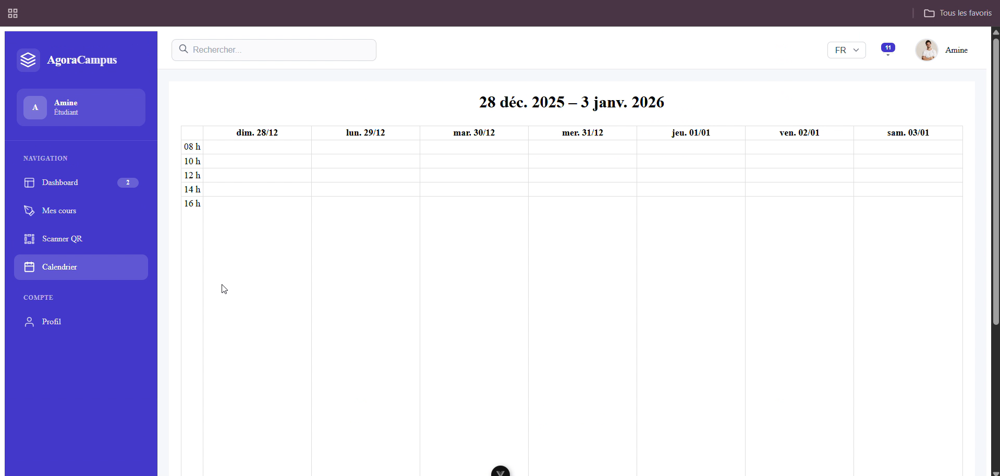

# AgoraCampus

AgoraCampus est une application web de gestion académique destinée aux étudiants et aux établissements.
Elle permet le suivi des cours, absences, annonces et informations personnelles via une interface moderne et intuitive.

---

# AgoraCampus – Screenshots

---

## Login

---
## Espace Étudiant

---

## Cours

---

## Calendrier

---

